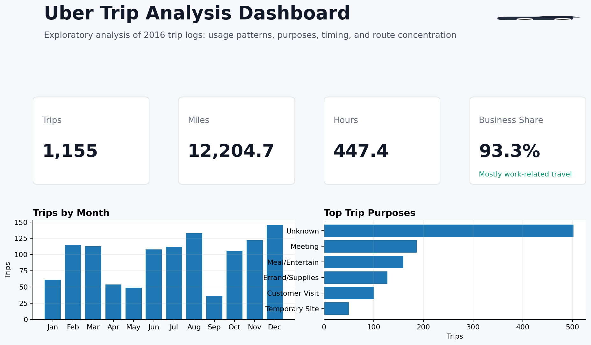
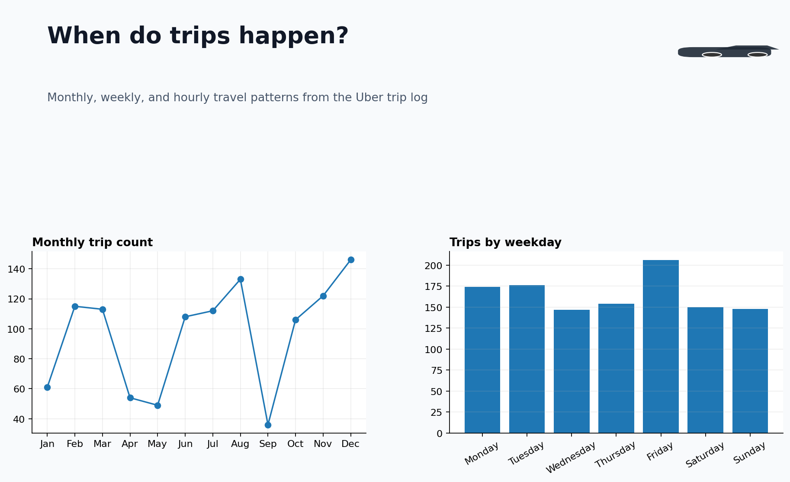
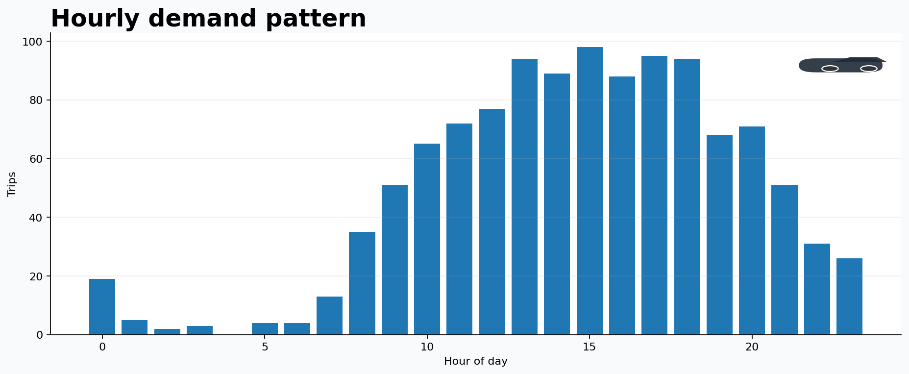
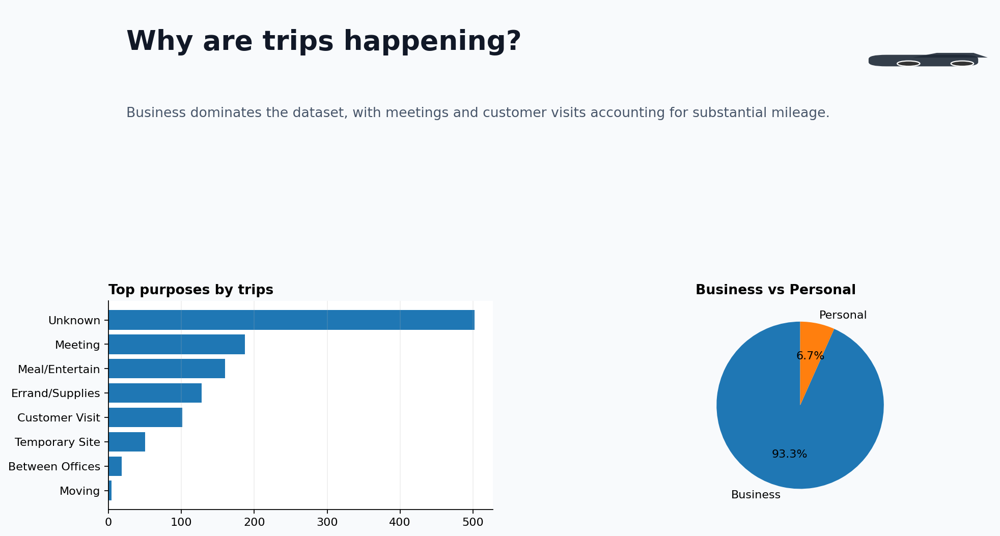
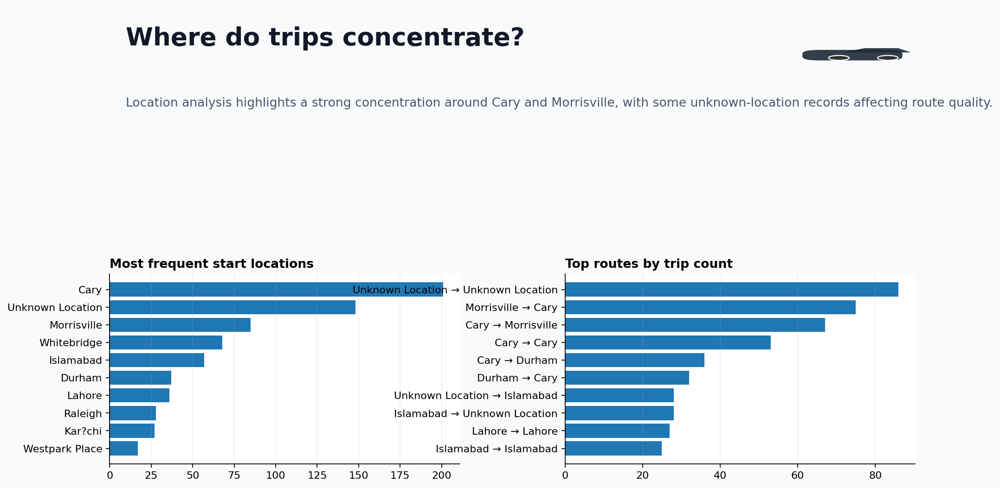

# Uber Trip Analysis Dashboard

This project analyzes trip behavior, business vs personal usage, monthly patterns, trip purposes, and location hotspots.

## Project Goal

Turn a raw Uber trip log into a polished analytics case study that can be added to a portfolio, resume, and GitHub.

## Dataset

- Source: `UberDataset.csv`
- Records analyzed: **1,155**
- Core fields: `START_DATE`, `END_DATE`, `CATEGORY`, `START`, `STOP`, `MILES`, `PURPOSE`

## Key Questions Answered

- How many trips were recorded and how many miles were covered?
- Is usage primarily business or personal?
- Which months, weekdays, and hours have the highest trip volume?
- What are the most common trip purposes?
- Which locations and routes appear most often?
- What data-quality issues should be addressed before deeper modeling?

## Tech Stack

- Python
- Pandas
- Matplotlib
- SQL

## Screenshots

### Executive Dashboard



### Monthly and Weekly Patterns



### Hourly Demand



### Purpose and Category Analysis



### Route Hotspots



## Project Structure

```text
ajay_uber_trip_analysis_project/
├── dataset/
│   ├── UberDataset.csv
│   └── uber_trip_analysis_cleaned.csv
├── sql/
│   └── analysis_queries.sql
├── screenshots/
│   ├── executive_dashboard.png
│   ├── monthly_weekday_patterns.png
│   ├── hourly_demand.png
│   ├── purpose_category_analysis.png
│   └── route_hotspots.png
├── analysis.py
├── analysis_walkthrough.md
├── insights.md
└── README.md
```

## Main Findings

- **93.3%** of trips are categorized as business.
- Total distance covered is **12,204.7 miles** across **447.4 hours**.
- The busiest month by trip count is **Dec** with **146 trips**.
- **Friday** is the busiest weekday.
- A large share of rows have `Unknown` purpose, which becomes an important data-quality insight.
- Cary and Morrisville form the strongest recurring route cluster.

## How to Run

```bash
pip install pandas matplotlib numpy
python analysis.py
```

## Important Note

This dataset behaves more like a **trip log / travel behavior dataset** than a ride-hailing marketplace revenue dataset.  
That is why this project focuses on:

- travel patterns
- trip categorization
- time analysis
- route hotspots
- data quality and operational insights

## Author

Ajay Tormal
